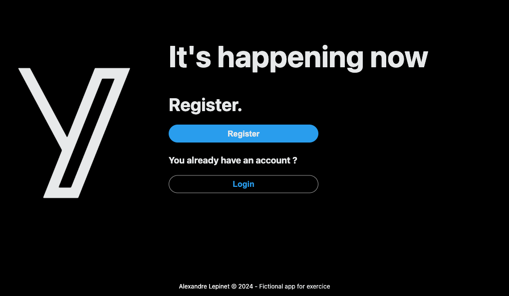

# Le projet : Mini twitter

**#React #Jotai #Strapi #Scss #PWA**

## Instructions

Créer une Progressive Web App (PWA) d'un mini réseau social, fait en utilisant React et Jotai, intégrant un système d'authentification. Aucun design particulier n'est attendu.

Les fonctionnalités sont les suivantes:

- Pouvoir s'inscrire, se connecter, se déconnecter
- Pouvoir accéder à son profil, le modifier, et accéder à celui des autres utilisateurs
- Pouvoir voir la liste de tous les posts de l'app, triés par dates, sur la page d'accueil, seulement si on est connectés. Pouvoir en poster également, et cliquer sur le username de l'auteur pour voir son profil
